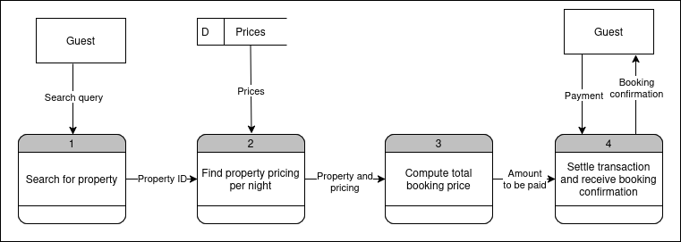

## Data Flow Diagram

The data flow diagram provides a visual representation of the flow of data within the system. It highlights the various processes, data stores, and data flows that interact to manage user requests and system responses.

### Key Components

- **Processes**: Illustrates the operations performed on the data.
- **Data Stores**: Represents where data is stored within the system.
- **Data Flows**: Shows the movement of data between processes and data stores.

### Usage

Understanding the data flow diagram can help stakeholders and developers gain insights into how the system handles data, ensuring efficient and secure data processing.

