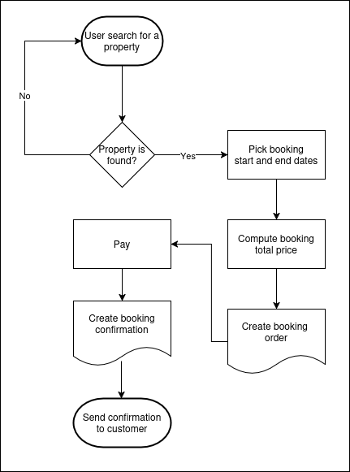

# Flowcharts

This directory contains flowcharts illustrating the system processes for better visualization and understanding.

The flowcharts are created using [draw.io](https://www.draw.io/) and are stored as XML files. You can open them using draw.io or any other compatible tool.

## Data Flow Diagram

The data flow diagram shows the flow of data through the system. It is a high-level overview of how the system processes data.

