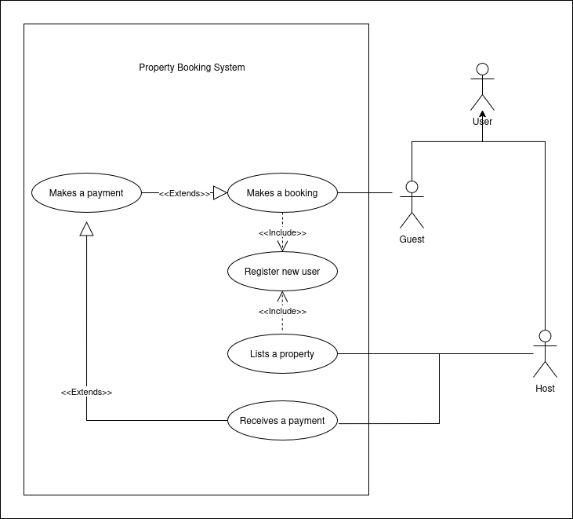

# Use Case Diagram

This use case diagram illustrates the different actors and use cases for the Airbnb Clone project.

## Actors

* **Guest**: A person who wants to book a property through the Airbnb Clone platform.
* **Host**: A person who wants to list their property on the Airbnb Clone platform.
* **Admin**: A person who is responsible for managing the Airbnb Clone platform.

## Use Cases

* **Search Properties**: The guest searches for properties based on their preferences.
* **Book Property**: The guest books a property through the Airbnb Clone platform.
* **Add Property**: The host adds a new property listing to the Airbnb Clone platform.
* **Edit Property**: The host edits an existing property listing on the Airbnb Clone platform.
* **Delete Property**: The host deletes a property listing from the Airbnb Clone platform.
* **Manage Bookings**: The admin manages bookings, including canceling or modifying bookings.
* **Manage Properties**: The admin manages properties, including adding, editing, or deleting property listings.
* **Manage Users**: The admin manages users, including adding, editing, or deleting user accounts.